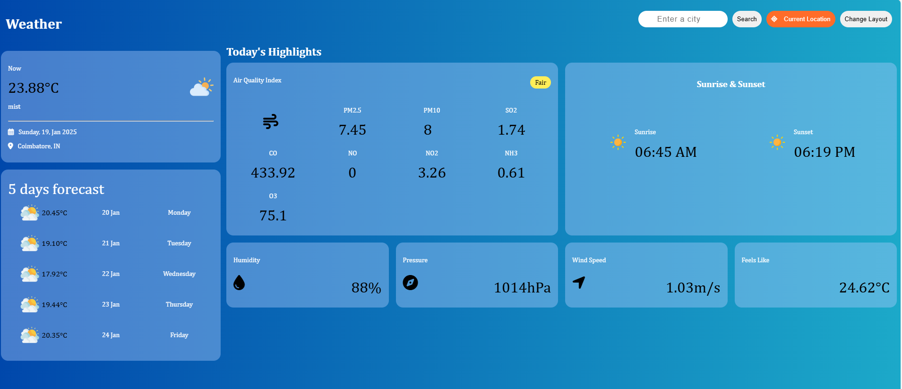

# Weather Web Application  

## Overview  
The **Weather Web Application** provides users with detailed weather information, including:  
- Current Weather: Temperature, humidity, pressure, wind speed, and "feels like" temperature.  
- 5-Day Forecast: Weather details for the next five days.  
- Additional Details: Sunrise and sunset timings.  

This project is built with **HTML, CSS, and JavaScript** and includes dynamic responsiveness using **media queries** for an optimized experience across devices.  

---

## Features  
- Real-time weather updates fetched from an API.  
- Detailed 5-day forecast.  
- Sunrise and sunset timings for the selected location.  
- Displays humidity, pressure, wind speed, and "feels like" temperature.  
- Mobile-friendly design with responsive layouts.  

---

## Key Learnings  
- Fetching and handling data from APIs.  
- Using **moment.js** for formatting date and time.  
- Structuring a web page with clean and reusable HTML and CSS.  
- Implementing responsive designs with **media queries**.  

---

## Tech Stack  
- Frontend: HTML, CSS, JavaScript  
- Responsive Design: Media Queries  
- API Integration: Fetch API  
- Libraries: moment.js  

---
## Prerequisites  
To run this project locally, you need to have the following installed:  
- Node.js  
- npm (Node Package Manager)  

Install **moment.js** using the following command:  
```bash  
npm install moment --save
```

---

## Screenshot  
  

## Contact
For any questions or feedback, feel free to reach out at:
Email: harivenkatesh1505@gmail.com
LinkedIn:[Hari's LinkedIn Profile](https://linkedin.com/in/hari1505)


